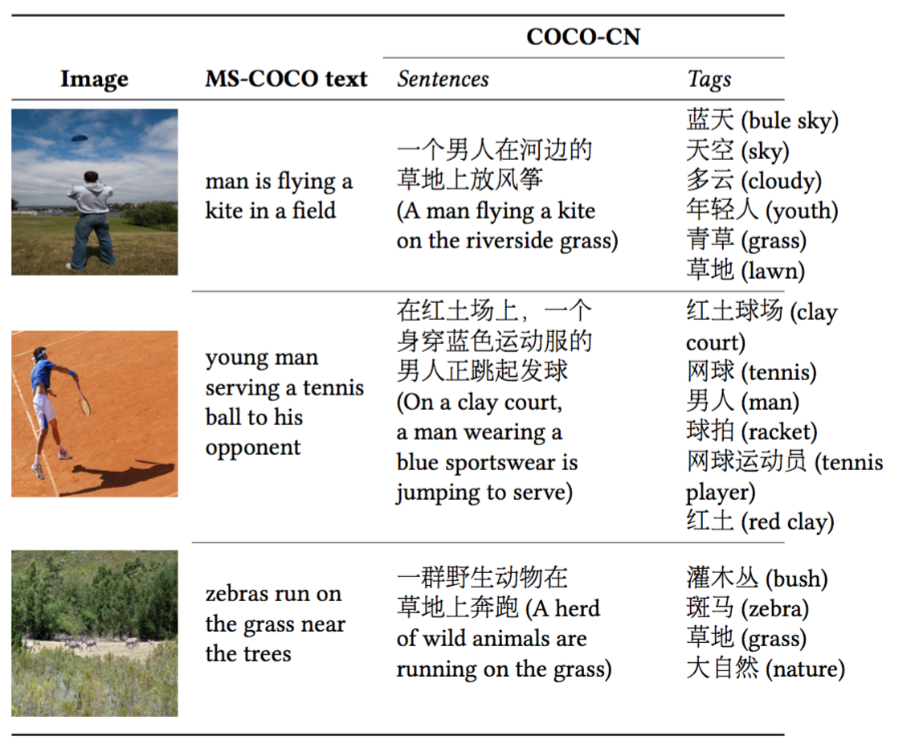

# COCO-CN

COCO-CN is a bilingual image description dataset enriching MS-COCO with manually written Chinese sentences and tags. The new dataset can be used for multiple tasks including image tagging, captioning and retrieval, all in a cross-lingual setting. 

| Chinese sentences | COCO-CN train | COCO-CN val | COCO-CN  test| 
| -----:| -----:| -----:| -----:|
| human written    | :white_check_mark: | :white_check_mark: | :white_check_mark: | 
| human translation     | :x:     |   :x:  | :white_check_mark: | 
| machine translation (baidu)  | :white_check_mark: | :white_check_mark: | :white_check_mark: | 

## Data

* [version 201805](data/coco-cn-version1805.tar.gz): 20,341 images (training / validation / test: 18,341 / 1,000 /1,000), associated with 22,218 ***manually written*** Chinese sentences and 5,000 ***manually translated*** sentences.

## Citations

* Xirong Li, Xiaoxu Wang, Chaoxi Xu, Weiyu Lan, Qijie Wei, Gang Yang, Jieping Xu, [COCO-CN for Cross-Lingual Image Tagging, Captioning and Retrieval](https://arxiv.org/abs/1805.08661), CoRR abs/1805.08661, 2018
