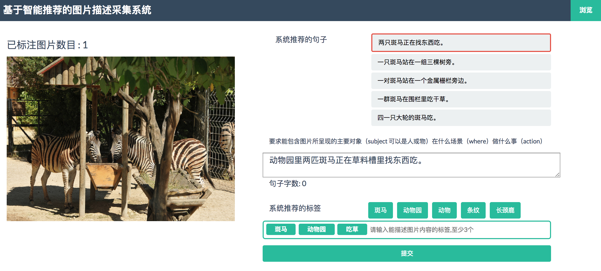

# Web-based recommendation-assisted image annotation




## Requirements
* python 2.7
* numpy
* tqdm
* web.py

## Get started

### Data

As provided in the `sample_data` folder.

### Script
```shell
# initialize database
./do_prepare.sh

# start image tagging server
./start-server.sh  # the annotation system will run at http://localhost:9090

# Optionally, start administration server
./start-server-admin.sh # the dashboard system will run at http://localhost:9001
```

## Go further

### Script
```shell
# create new user
python create_new_user.py

# export annotations
python export_annotations.py
```

## Developers 

+ Xiaoxu Wang
+ Yuan Bian
+ Chaoxi Xu

