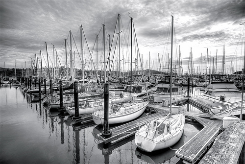
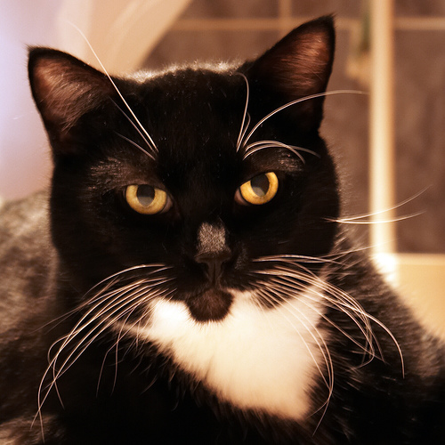
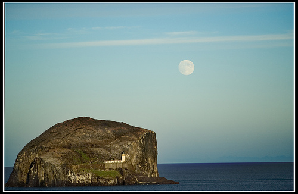

# NUS-WIDE100

The nuswide100 dataset consists of 100 images randomly selected from the NUS-WIDE dataset, for the purpose of evaluating different cross-lingual image tagging and captioning models on images that are not from MS-COCO. The folder contains

+ jpeg images
+ cnn features extracted by a pre-trained ResNeXt-101 model
+ Original Flickr tags associated with each image
+ Manually verified Chinese tags per image

| image | Flickr tags | Chinese tags |
| -----:|:----- |:----- | 
|  | usa california hdr sausalito marina boats sailboats bw hdri 2007 year2007 geotagged geotag march winter outdoor outside exterior travel trip vacation journey holiday nikon nikond200 d200 photomatix tonemapping tonemapped tone mapping highdynamicrangeimaging high dynamic range imaging flickr photo wikipedia yahoo | 港口    小船    船      水域    停泊    停靠    码头 | 
|  | jack tuxedocat bathroom toilet guard findleastinteresting | 猫      眼      宠物    可爱的  小猫    白色    黑色    黑猫    特写 | 
|  | bassrock scotland forth sea seals tide seal seagull scottish scots puffin nikon lighthouse landscape gull d50 cliff moon | 天空    海      景观    水域    岩石    云      海洋    石头 | 

